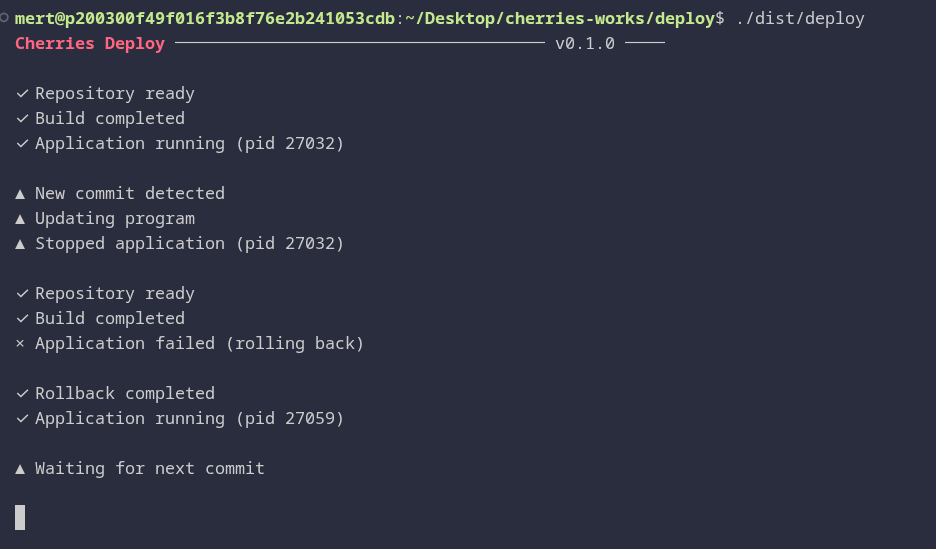

# Deploy

Lightweight Linux system deployment tool written in C.

Deploy deploys anything you want it to within seconds, has automatic rollbacks
for worse-case scenarios. Configure a simple config.toml file, in human-readable
form, and run ./deploy.



## Features

* Deployment
* Rollback
* Auto-Update
* Hash-Tracking
* Sleep between lookups

## Philosophy

Deploy aims to be the fastest and simplest way to deploy an app:

* Fast
* Lightweight
* Self-hosted
* Human readable
* Low resource usage

## Installation

```bash
  $ git clone https://github.com/cherries-works/deploy.git
  $ cd deploy
  $ make
```

Before running deploy, make sure to have a config.toml file
ready with the correct configurations.

## Config

The default configuration file Deploy will look for is /cherries-deploy.toml.
Custom config paths can be specified with the --config args.

```bash
  $ ./dist/deploy --config ./configs/deploy.toml
```

## Roadmap

* Rolling Deployments
* Multiple Process
* Monitoring

## License

MIT
